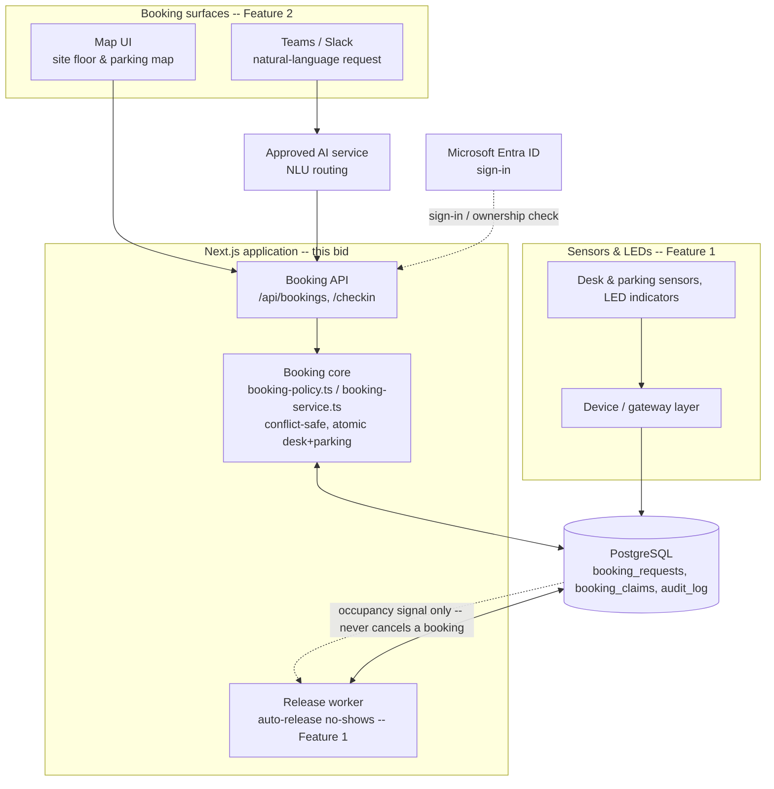

# Full solution proposal (draft)

**Camp step 1: "Cover the complete specification. Explain value, architecture,
delivery approach, team, timeline and price."**

This is working source material for slides 1, 3, 4, 8 and 9 of the ten-slide
deck -- not final slide copy. Source: `ZRS_Camp_2026_Smart_Office_Reviewed_Plan.md`
and `ZRS_Camp_Project_Task.pdf`. See "Boundaries and open items" at the bottom
before treating any figure here as final.

---

## Value

### **A smarter way to use the space you already have.**
Three things make this solution pay off for the client's office of about 200 employees:

**#1 — Stop paying for space nobody uses.**
Bookings without accepted check-in are released automatically at the agreed deadline, so unused desks and parking return for the next permitted booking. Occupancy sensing can help confirm use and flag mismatches. The pilot will measure how often released spaces are reused.

**#2 — Easy to book, two ways.**
A visual map of the office floor and parking lot lets employees see and pick the exact spot they want. A natural-language request through the company's own channels (Teams, Slack—"a desk and parking tomorrow afternoon") gets the same result faster, through the same validated booking service—and opens the door to automating the booking operation itself.

**#3 — A delivery model that de-risks the investment.**
Our POC is not just a demo—it shows an Agentic SDLC where every decision is traceable and human-approved before it ships: no ungoverned output, no surprises at review. It's why this went from brief to a working proof of concept in two days, and why the same team and process can take the solution from a two-day POC to a 5,000-employee platform without a rewrite, on a predictable budget and timeline.

## Complete specification coverage

**This bid prices only the three value-carrying features above, built to
production grade for the pilot site** -- not the full client specification.
Everything else the spec describes is real and valuable, but it's a future
phase, not part of this bid or its price below (see the decision record
`docs/decisions/0003-scope-to-three-value-features.md`).

| Capability area | What it covers | In this bid? | POC status |
|---|---|---|---|
| Resource booking | Desk + parking booking via a visual map of the office floor and parking lot, morning/afternoon/full-day choice (pending facilitator decision), combined atomic requests, 14-day horizon | **Yes** -- Feature #2 | **Built** (FR-03); POC offers a specific-space picker on an illustrative synthetic layout or automatic assignment, plus cancellation before check-in. A site-accurate floor plan is priced in this bid. |
| Check-in & automatic release | App check-in within a deadline protects a booking; a no-show releases it for someone else | **Yes** -- Feature #1 | **Built** (FR-08, FR-09) |
| Conversational booking | A faster, complementary path to the same map-based booking: natural-language request ("parking and a desk tomorrow afternoon") through Teams/Slack, routed through the same validated booking service | **Yes** -- Feature #2 | Guided-chat prototype or live AI service, labelled accordingly |
| Occupancy sensing & indicators | Desk/parking presence sensors, LED status (bookable / reserved / in use / needs review), usage evidence and exceptions on mismatch | **Yes** -- Feature #1 | Simulated in the POC |
| Identity | Corporate sign-in ties every action to a verified employee | **Minimal** -- required so Features #1/#2 work for real employees, not a feature of its own | Synthetic adapter in the POC; Microsoft Entra ID sign-in in this bid |
| Administration | Office hours, deadlines, check-in methods, resource states, configurable per office/resource type | **No** -- deferred | Not started; config seeded manually for the pilot site |
| Audit & reporting | Full audit trail of booking/check-in/release events (already logged in the POC's `audit_log` table); utilization and no-show reporting | **No** -- deferred (data keeps logging; the reporting UI doesn't) | Data captured in POC |
| Multi-office & scale | Design for multiple offices and 5,000+ users from one Serbian-office pilot | **No** -- deferred; this bid is single-site | Architected for, not load-tested, in the POC |
| Security, privacy, reliability | Access control, data protection, availability/recovery targets | **Minimal** -- scoped to what the pilot site needs, not the 5,000-user target | Full future-phase scope, see Architecture |

## Architecture

**This bid's architecture** extends the POC's Next.js/TypeScript application
rather than replacing it, scoped to the pilot site and the three
value-carrying features:



**Reading the diagram:** both booking surfaces converge on the same API and
booking core -- one set of conflict-safety guarantees regardless of channel.
Entra gates every write (dotted). The release worker releases on the
check-in deadline alone; the dotted line shows it separately reading the
sensor signal from the database afterward, only to flag a mismatch for
review. The signal never drives or blocks the release itself, matching the
"a sensor never cancels a booking by itself" rule below.

- **Booking core** (proven in the POC): resources modelled as morning/afternoon
  claims, with database constraints -- not just application code -- enforcing
  that no resource or employee holds two active overlapping claims, regardless
  of which surface (map UI, chat) created the request. This is the
  load-bearing design decision behind the "trustworthy booking" promise.
- **Identity**: Microsoft Entra ID for sign-in; server-side ownership checks
  on every action (an employee sign-in establishes identity, an app check-in
  establishes declared arrival -- kept as two distinct events). Scoped to
  sign-in and ownership only -- no admin role model in this bid.
- **Occupancy**: sensor/LED readings stored as a signal separate from booking
  rights. A sensor never cancels a booking by itself; a mismatch (occupied
  without a booking, or a stale reading) raises a review exception instead of
  an automatic action.
- **Operations**: separate development, test and production environments;
  automated quality/security checks in CI; human approval gate before
  production release; a documented check-in event interface so sensor
  vendors integrate against a stable contract.
- **Data & integrations**: PostgreSQL as the system of record; Entra ID for
  identity; an approved AI service for the Teams/Slack conversational
  channel; a device/gateway integration layer for sensors and LEDs, chosen
  through the pilot rather than committed to upfront.
- **Security & privacy**: booking data reveals who sits where -- treat it as
  sensitive personal data, with access scoped to the employee and admins for
  the pilot site; no client data, credentials or licences used anywhere in
  build or demo (POC uses only synthetic data throughout).

**Deferred to a future phase, not part of this bid's architecture or price:**
an administration console, notifications, an audit/reporting UI (the
`audit_log` table keeps logging either way), and the scale targets for
multiple offices and 5,000+ users (99.9% availability, 15-minute recovery
point, 4-hour recovery time). These stay real requirements for the full
specification -- they're just not what this bid builds or charges for.

## Delivery approach

The engagement follows the same Agentic SDLC used to build the POC, scaled up
(see `AGENTS.md` and the SDLC-for-full-delivery narrative for the full
version):

```
Brief -> agent refinement -> human acceptance criteria -> agent plan
      -> human design approval -> implementation -> independent checks/review
      -> correction -> human acceptance
```

This bid adds: CI/CD automation around this loop, security/dependency
scanning agents, and a governance gate (human release approval) at every
deployment -- not just at the end of a feature. Client involvement happens at
defined points: office hours/policy configuration in discovery, design
approval on architecture and the booking-policy decision record, and
acceptance review at the end of each phase below.

**Delivery phases** (person-days at €800/day, scoped to the three
value-carrying features -- see `docs/decisions/0003-scope-to-three-value-features.md`).
Person-days are **billed working time only**: headcount actually engaged x
working days, for build time (Agentic SDLC-assisted implementation, review,
testing) or on-site presence (workshops, installation, training). Time spent
waiting on an external party is not billed; it shows up in the Timeline
below, not in the price.

| Phase | Focus | Team engaged | Working days | Person-days |
|---|---|---|---:|---:|
| Discovery | Site floor plan & parking layout, Teams/Slack and Entra readiness, sensor vendor shortlist, half-day decision | Product/proposal lead + Technical lead (on-site) | 10 | 20 |
| Feature #1 -- Auto-release + hardware | Release-worker hardening, real sensor/LED integration, install & calibration | Backend engineer + Platform/integration engineer | 15 | 30 |
| Feature #2 -- Easy booking, two ways | Site-accurate map UI, Teams/Slack booking channel | Frontend engineer (full) + Technical lead (part-time) | 15 + 10 | 25 |
| Identity & hardening | Entra sign-in wiring, security/privacy pass for the pilot site | Backend engineer + QA/evidence lead | 10 | 20 |
| Pilot | Acceptance, training, handover | Product/proposal lead + QA/evidence lead (on-site) | 10 | 20 |
| **Base total** | | | | **115** |

Features #1 and #2 run **in parallel** (different people, same 3 weeks) --
the same small-team, human-gated Agentic SDLC that built the POC in two days,
scaled to a real pilot rather than sequenced phase-by-phase.

## Team

The camp team's role model carries directly into the delivery engagement --
the same six functions, staffed to the phase's workload:

| Role | Responsibility |
|---|---|
| Product/proposal lead | Client story, requirements, scope, client-facing decisions and reporting |
| Technical lead | Interfaces, architecture, integration and technical decisions |
| Frontend engineer | Booking/check-in screens, conversational interface, accessibility |
| Backend engineer | Database, booking, check-in, release, administration logic |
| QA/evidence lead | Acceptance criteria, testing, release evidence |
| Platform/integration engineer | Environments, CI/CD, device/sensor integration, operations |

Governance: a joint steering point at the end of each delivery phase, with the
client reviewing acceptance evidence before the next phase's budget is
released.

## Timeline

**About 9 weeks baseline, up to 11 weeks with schedule contingency**,
sequenced as: Discovery -> Features #1 and #2 in parallel -> Identity &
hardening -> Pilot.

This is **calendar time, not billed time**: it includes waiting on external
dependencies the team doesn't control -- Entra tenant provisioning, sensor
vendor lead times and installation scheduling, and facilitator decision
turnaround -- confirmed in Discovery. Those waits stretch the schedule; they
don't add person-days to the Price below unless the team is on-site for them
(installation and calibration days, for instance, are on-site and billed).

### Indicative Gantt

Dates are illustrative (kickoff = day 1 of Discovery); the actual start date
is confirmed at contract signature. Bar length is calendar duration, not
billed effort -- for person-days see the Delivery phases table above.

```mermaid
gantt
    title Smart Office pilot delivery -- indicative timeline (3 value-carrying features)
    dateFormat  YYYY-MM-DD
    axisFormat  %b %d

    section Discovery
    On-site: workshops, site & tenant assessment          :crit, disc1, 2026-01-05, 2w

    section Feature 1 -- Auto-release + hardware
    Implementation: release logic, sensor/LED integration :active, f1, after disc1, 3w
    On-site: sensor & LED install, calibration            :crit, f1on, 2026-02-02, 1w

    section Feature 2 -- Easy booking, two ways
    Implementation: map UI, Teams/Slack booking channel   :active, f2, after disc1, 3w

    section Identity & hardening
    Implementation: Entra sign-in, security/privacy pass  :active, hard1, after f1, 2w

    section Pilot
    On-site: training, acceptance, handover               :crit, pilot1, after hard1, 2w

    section Contingency
    Schedule buffer (unbilled)                            :done, buf1, after pilot1, 2w
```

**Reading the chart:** red bars (crit) are time on-site with client staff --
workshops, sensor/LED install and calibration, training and acceptance. Blue
bars (active) are implementation -- remote build work by the Agentic SDLC
team. The grey bar is the contingency buffer: schedule risk margin, not
billed (see Price). Features #1 and #2 run side by side, built by different
people, which is what compresses 9 weeks of calendar time into what would
otherwise be closer to 12.

## Price

Billed at **€800/day for days actually worked** -- build time or on-site
presence, never calendar time spent waiting on an external party (see
Timeline). Scoped to the three value-carrying features only (see Complete
specification coverage and `docs/decisions/0003-scope-to-three-value-features.md`).

| Item | Person-days | Cost at €800/day |
|---|---:|---:|
| Base software estimate | 115 | €92,000 |
| 20% contingency | 23 | €18,400 |
| **Indicative software envelope** | **138** | **€110,400** |

If the facilitator declines the half-day booking amendment, Feature #2's
build shortens slightly (a simpler full-day-only period selector, less
overlap-rule testing): **112 base + 22 contingency = 134 person-days,
€107,200** at the same rate.

**Not priced in this bid -- future phase, once the pilot proves the model:**
administration console, notifications, audit/reporting UI, multi-office
rollout and the 5,000-user scale targets (see Architecture and Complete
specification coverage).

**Shown separately, not included above:**
- Cloud hosting allowance: **€600-1,200/month** (unvalidated placeholder; excludes AI consumption and device costs).
- Desk/parking sensors, LEDs, gateways, installation, calibration, licences and maintenance for up to 150 desk and 30 parking sensor points -- **requires a supplier-backed quote before it can be presented as a total.**
- AI service consumption for the conversational assistant, once usage patterns are known.

This is an indicative fictional bid estimate for the camp, not a fixed-price
commitment.

---

## Boundaries and open items

- **This bid is scoped to three value-carrying features, not the full
  specification** -- see `docs/decisions/0003-scope-to-three-value-features.md`.
  The client's full **Smart Office System Specification** (19 functional
  requirements, 9 business rules, 14 quality requirements) is referenced by
  the plan but was not available when this draft was written. A full
  requirement traceability matrix is only needed for the in-scope areas
  (Resource booking, Check-in & automatic release, Conversational booking,
  Occupancy sensing & indicators, plus minimal Identity); everything marked
  "No -- deferred" in Complete specification coverage stays out of this
  bid's traceability until it's actually scoped.
- The half-day booking policy is **still pending a written facilitator
  decision** -- see `docs/decisions/0001-half-day-booking-policy.md`. Both the
  capability table and the price table above already carry the fallback if
  it's declined; update the "Value" and "Complete specification coverage"
  sections' wording (morning/afternoon vs. full-day-only) once the decision
  lands.
- Team member names, exact roadmap dates and Entra/AI tenant specifics are
  intentionally left generic/placeholder -- fill in once confirmed with the
  facilitator and the team.
- The person-days and Gantt above are a **bottom-up estimate** (team engaged
  x working days per feature), not the previous top-down planning number --
  validate the headcount assumptions with the actual delivery team before
  quoting a fixed price.
